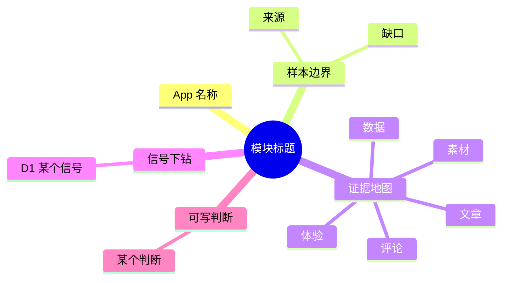

# 脑图交互交接说明

这份交接面向需要把本项目“可交互脑图”迁移到另一个项目的 agent。当前项目里有两类脑图相关能力：

1. 真正可交互的 Markmap HTML 渲染器：`scripts/render_markmap_html.mjs`
2. 报告页里的 Mermaid mindmap 源码展示与复制：`public/reports.html` + `public/js/production-reports.js`

如果目标是复用“可以缩放、拖拽、展开/折叠、适配画布”的交互，应优先迁移第 1 类，也就是 `scripts/render_markmap_html.mjs`。

## 一、当前实现入口

### 1. npm script

`package.json` 中已有命令：

```json
{
  "scripts": {
    "mindmap:render": "node scripts/render_markmap_html.mjs"
  }
}
```

使用方式：

```bash
npm run mindmap:render -- --input path/to/input.md
```

默认输出到：

```text
.tmp/mindmaps/<input-file-basename>.html
```

也可以指定输出：

```bash
npm run mindmap:render -- --input path/to/input.md --output path/to/output.html
npm run mindmap:render -- --input path/to/input.md --outputDir .tmp/custom-mindmaps
```

### 2. 核心文件

```text
scripts/render_markmap_html.mjs
```

这个脚本做三件事：

- 读取 Markdown 文件。
- 把 Markdown 嵌入一个独立 HTML 页面。
- 在浏览器中用 `markmap-autoloader` 把 Markdown 转成可交互 SVG 脑图。

外部依赖通过 CDN 加载：

```js
const MARKMAP_AUTOFIT_URL = "https://cdn.jsdelivr.net/npm/markmap-autoloader@0.18.12";
```

如果另一个项目不能访问公网，需要把 `markmap-autoloader` 改成本地静态资源或 npm 打包依赖。

## 二、交互能力清单

`scripts/render_markmap_html.mjs` 生成的 HTML 目前支持：

- 自动把 Markdown 标题层级渲染成脑图。
- SVG 画布自适应浏览器窗口。
- 鼠标滚轮/触控板缩放。
- 拖拽平移画布。
- 点击节点可使用 Markmap 默认折叠/展开交互。
- 顶部按钮：
  - `适配画布`：调用 `mm.fit()`
  - `全部展开`：重建 root，递归设置所有节点展开，再 `mm.setData(...)`
  - `全部折叠`：重建 root，递归设置所有节点折叠，但保持根节点展开
- 自定义层级间距：渲染后手动调整 `g.markmap-node` 和 `path.markmap-link` 的位置，让浅层节点不那么挤。

## 三、关键实现点

### 1. 等待 Markmap 加载

脚本中通过轮询等待 `window.markmap.Transformer` 和 `window.markmap.Markmap` 可用：

```js
function waitForMarkmap() {
  return new Promise((resolve, reject) => {
    const startedAt = Date.now();
    (function poll() {
      if (window.markmap?.Transformer && window.markmap?.Markmap) {
        resolve(window.markmap);
        return;
      }
      if (Date.now() - startedAt > 10000) {
        reject(new Error("markmap 加载超时"));
        return;
      }
      setTimeout(poll, 60);
    })();
  });
}
```

迁移时可以保留。若目标项目用 Vite/React/Next 等前端框架，建议改成模块导入，但交互逻辑基本不变。

### 2. 初始化 Markmap

核心配置在 `Markmap.create(...)`：

```js
const mm = Markmap.create(svg, {
  autoFit: true,
  colorFreezeLevel: 2,
  duration: 200,
  fitRatio: 0.92,
  initialExpandLevel: 2,
  maxWidth: 320,
  paddingX: 20,
  scrollForPan: true,
  zoom: true
}, createRoot());
```

几个重要配置：

- `initialExpandLevel: 2`：初始展开到第 2 层。
- `maxWidth: 320`：节点文本最大宽度。
- `scrollForPan: true`：滚动/触控板行为用于画布平移。
- `zoom: true`：允许缩放。
- `fitRatio: 0.92`：适配画布时保留一点边距。
- `colorFreezeLevel: 2`：颜色在前两层固定，层级视觉更稳定。

### 3. 全部展开/折叠

Markmap 的节点折叠状态写在 `node.payload.fold`：

```js
function setFoldState(node, folded, keepRootExpanded = false, depth = 0) {
  node.payload = node.payload || {};
  node.payload.fold = keepRootExpanded && depth === 0 ? 0 : (folded ? 2 : 0);
  if (Array.isArray(node.children)) {
    node.children.forEach((child) => setFoldState(child, folded, keepRootExpanded, depth + 1));
  }
}
```

当前约定：

- `fold = 0`：展开。
- `fold = 2`：折叠。
- “全部折叠”时根节点保持展开，否则整张图会只剩 root，不便继续操作。

### 4. 自定义节点间距

`applyLevelSpacing(svg)` 是本项目的定制逻辑。Markmap 默认布局在节点多时会偏挤，所以这里在渲染后按层级和父节点分桶，给同一组兄弟节点追加纵向 offset，并同步重画连线。

当前额外间距规则：

```js
function layoutExtraOffset(depth) {
  if (depth === 1) return 20;
  if (depth === 2) return 10;
  return 0;
}
```

迁移建议：

- 如果目标项目只是要基本交互，可以先不迁移 `applyLevelSpacing`。
- 如果目标项目的脑图节点很多，建议保留，否则浅层分支会明显拥挤。
- 这段逻辑依赖 Markmap 生成的 DOM 类名和 D3 datum：`g.markmap-node`、`path.markmap-link`、`group.__data__`。升级 Markmap 版本后要回归验证。

## 四、输入数据格式

`render_markmap_html.mjs` 接收普通 Markdown，不要求 Mermaid。

示例：

```md
# 根主题

## 样本边界

### 来源

- 文章
- 数据

### 缺口

- 评论不足

## 可写判断

### 判断 A

正文也会被 Markmap 作为节点解析，建议输入尽量保持短标题和短 bullet。
```

注意：

- Markmap 更适合标题层级清楚、节点文字短的 Markdown。
- 长段落会变成很宽/很重的节点，建议迁移时在上游先做“脑图版 Markdown”。
- 当前脚本会把 Markdown 放进 `<script type="text/template">`，并用 `escapeTemplate` 处理 `</script>`，避免提前闭合脚本标签。

## 五、和 Mermaid mindmap 的关系

报告模块中还有一套 Mermaid mindmap 产物：

- 生成逻辑：`server/report-output-service.mjs`
  - `buildModuleMindmap(...)`
  - `extractMermaidMindmap(...)`
  - `writeModuleMarkdown(...)`
- 质量规则：`server/report-output-quality-rules.mjs`
- 前端展示：`public/reports.html`、`public/js/production-reports.js`

这套主要用于“报告产物里的脑图源码”和质量审计，不负责交互渲染。前端只是 textarea 展示和复制：

```js
selectedMindmap = extractMermaidMindmap(selectedMarkdown);
mindmapContentEl.value = selectedMindmap;
```

如果另一个项目已有 Mermaid mindmap，不能直接丢给 Markmap。需要二选一：

1. 保留 Mermaid：用 Mermaid 自己渲染，交互能力会弱一些。
2. 转成 Markdown 层级：再用 `render_markmap_html.mjs` / Markmap 交互。

当前项目的 Mermaid mindmap 示例结构：



这类结构可以机械转换为 Markdown：

```md
# 模块标题

## App 名称

## 样本边界

### 来源

### 缺口

## 证据地图

### 文章

### 数据

### 素材

### 评论

### 体验

## 信号下钻

### D1 某个信号

## 可写判断

### 某个判断
```

## 六、迁移方案建议

### 方案 A：最快迁移，保留独立 HTML 生成

适合另一个项目只需要“生成一个可打开的脑图 HTML”。

需要复制：

```text
scripts/render_markmap_html.mjs
```

然后在目标项目 `package.json` 加：

```json
{
  "scripts": {
    "mindmap:render": "node scripts/render_markmap_html.mjs"
  }
}
```

验证：

```bash
npm run mindmap:render -- --input ./example.md
open .tmp/mindmaps/example.html
```

### 方案 B：嵌入现有 Web 页面

适合目标项目要在页面内部显示交互脑图。

可抽取以下函数和逻辑：

- `waitForMarkmap()`
- `setFoldState(...)`
- `depthOf(...)`
- `layoutExtraOffset(...)`
- `applyLevelSpacing(svg)`
- `Transformer + Markmap.create(...)`
- 三个按钮事件：fit / expand / collapse

页面需要一个 SVG 容器：

```html
<svg id="mindmap"></svg>
```

以及 Markmap 依赖：

```html
<script src="https://cdn.jsdelivr.net/npm/markmap-autoloader@0.18.12"></script>
```

如果是现代前端工程，建议安装并导入：

```bash
npm install markmap-view markmap-lib
```

然后把 `window.markmap` 依赖改成模块导入。具体 API 名称和版本要以目标项目安装版本为准。

## 七、视觉样式

当前 HTML 的视觉基调是暖色纸面风：

- 背景：`#f5f1e8`
- 顶栏半透明：`rgba(255, 252, 245, 0.88)`
- 文本：`#221b16`
- 弱文本：`#6e6258`
- 顶部按钮为圆角 pill

布局：

- 页面根容器 `.shell` 使用两行 grid：顶栏 + 画布。
- `#mindmap` 高度为 `calc(100vh - 64px)`。
- 小屏下顶栏纵向排列，画布高度改为 `calc(100vh - 114px)`。

如果目标项目已有设计系统，保留 SVG 容器尺寸和按钮行为即可，样式可以重写。

## 八、常见坑

1. CDN 加载失败  
   页面会显示 `markmap 加载超时`。内网/离线环境要改本地依赖。

2. 输入 Markdown 太长  
   Markmap 会渲染，但节点可能过密。建议上游生成短标题树，而不是完整正文。

3. 全部折叠后布局没有马上更新  
   当前用 `requestAnimationFrame(...)` 延后调用 `applyLevelSpacing`，迁移时保留这个节奏。

4. Markmap 升级后自定义间距失效  
   `applyLevelSpacing` 读了 `group.__data__` 和 `path.__data__`，这是偏内部的结构。升级后检查节点和连线是否仍能拿到 `source/target/x/y/parent`。

5. Mermaid 和 Markmap 不是同一种输入  
   `scripts/render_markmap_html.mjs` 读的是 Markdown，不是 `.mmd`。如果上游只有 Mermaid mindmap，需要先转换。

## 九、推荐给目标 agent 的落地顺序

1. 确认目标项目需要独立 HTML 还是页面内嵌。
2. 如果要最快交付，直接复制 `scripts/render_markmap_html.mjs`，加 npm script。
3. 用一个 20-50 个节点的 Markdown 样例验证：
   - 初始展开到 2 层。
   - 点击节点可折叠/展开。
   - 适配画布按钮可用。
   - 全部展开/折叠可用。
   - 缩放和平移可用。
4. 如果目标项目使用 Mermaid mindmap，先写一个 Mermaid-to-Markdown 的小转换层，再交给 Markmap。
5. 若目标项目节点很多，保留 `applyLevelSpacing`；若节点少，可以去掉这段，减少对 Markmap 内部 DOM 的依赖。

## 十、最小可复用代码边界

最小交互闭环是：

- 一个 Markdown 字符串。
- 一个 `<svg>` 容器。
- Markmap 的 `Transformer` 和 `Markmap`。
- `Markmap.create(svg, options, root)`。
- `mm.fit()`。
- `mm.setData(nextRoot, { initialExpandLevel: -1 })`。

本项目额外增强是：

- 顶部工具栏。
- 全部展开/折叠。
- 自定义层级间距。
- 生成独立 HTML 文件。

